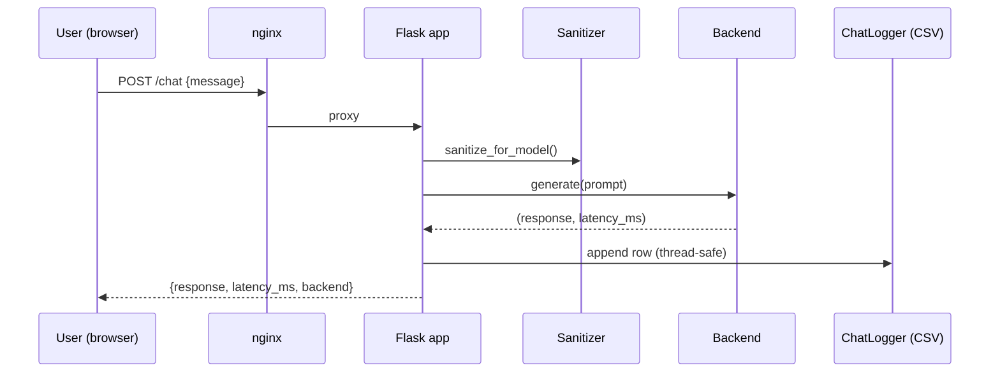

# Architecture

## Strategy pattern for inference

`app.py` is a thin conductor. All heavy lifting sits behind
`amplify.backends.base.BaseInferenceBackend` — a two-method contract:

```python
class BaseInferenceBackend(ABC):
    def warmup(self) -> None: ...
    @abstractmethod
    def generate(self, prompt: str) -> tuple[str, float]: ...
```

At boot, `get_backend(settings.BACKEND)` returns the correct adapter. Route
handlers never branch on backend name — they just call `.generate()`.

## Request lifecycle


